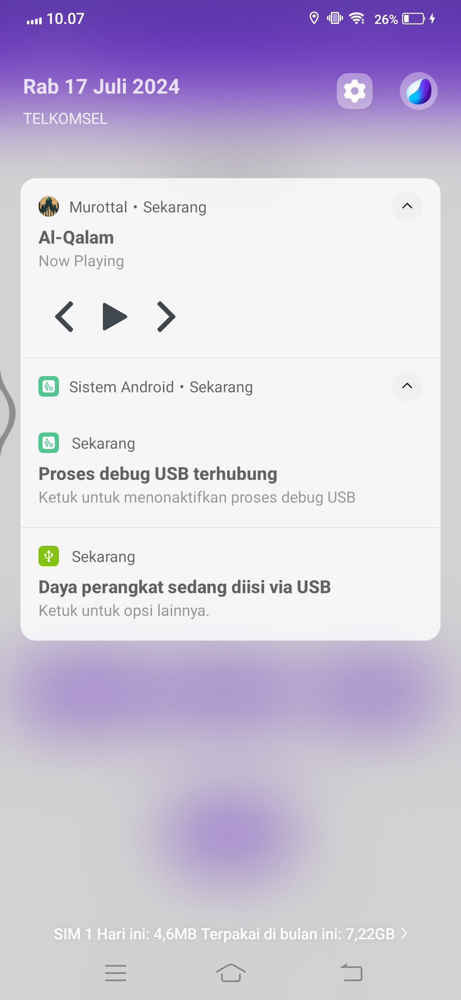

# Murottal Player

## About
Murottal Player is an Android application designed to play Islamic audio recitations (Murottal) of the Quran. This app provides a simple and intuitive interface for users to listen to various Quranic chapters (surahs) with ease.

## Features
- List view of available Quranic chapters
- Audio playback with play, pause, next, and previous controls
- Auto play next surah
- Background playback capability
- Option to reverse the order of the playlist
- Indication of currently playing track in the main list

## Technology Stack
- **Language**: Kotlin
- **Platform**: Android
- **Audio Playback**: ExoPlayer

## Purpose
This application is primarily developed as a demonstration of Android development skills, showcasing:
- Modern Android development practices
- Kotlin language features
- Audio playback handling
- Service implementation for background tasks
- UI design with Material Components

## Disclaimer
This app is not intended for production use. It serves as a portfolio piece to demonstrate Android development capabilities.

## Developer
Created by Dody Rachmat Wicaksono

For more information or to discuss potential projects, please visit my [Upwork profile](https://bit.ly/3Wm34Kd).

## Screenshots
### Home screen

### Player screen

### Audio controls in notification

